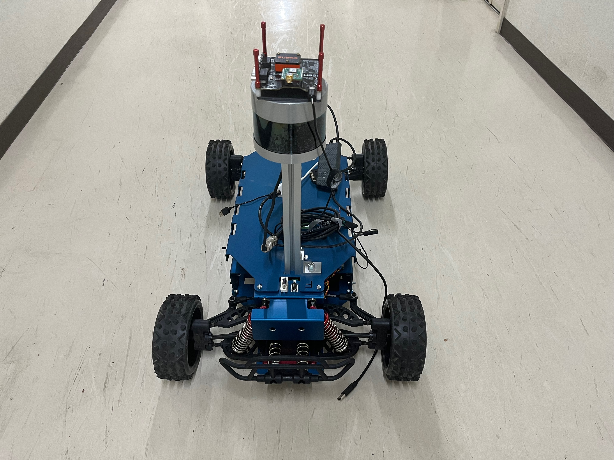
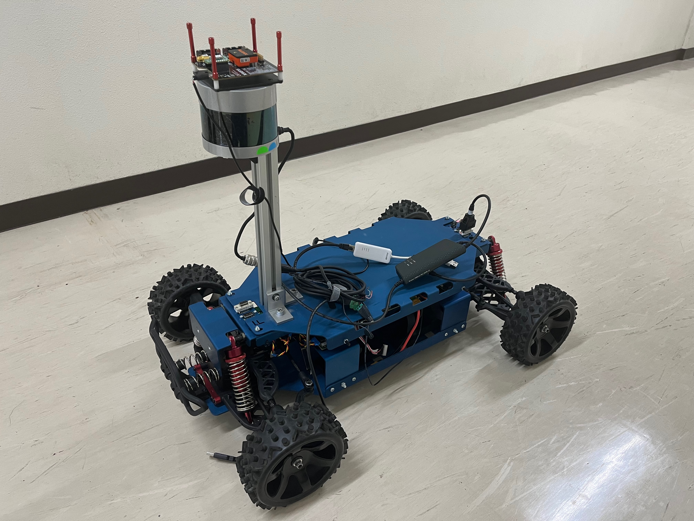

# The CanEduDev Demo Rover
The Demo Rover is a high-performance RC car created by [CanEduDev](https://www.canedudev.com/), a side venture of Kvaser.

<div style="display: flex; justify-content: space-around;">
  
  
</div>

## Features
### 1/5 Scale Size  

The Demo Rover is a 1/5 scale model of a real car. Its large size makes it perfect for outdoor driving and demonstrations, providing a visually impressive presence.

### Easy Hardware Mounting  

The vehicle is equipped with numerous mounting points, allowing for the easy attachment of various sensors, cameras, and other hardware. This makes it highly adaptable for research, development, and a wide range of projects.

### CAN Communication System  

The Demo Rover utilizes CAN (Controller Area Network) communication. This enables efficient and reliable data exchange between multiple electronic devices. 

### Powerful Performance  

The Demo Rover can reach speeds of up to 40 km/h. This high performance allows for extensive testing of high-speed driving and obstacle avoidance in large open areas.    

 If you need more detailed information, please refer to the page linked below.
[Demo Rover web page](https://www.canedudev.com/product/demo-rover/)

# Integrating Demo Rover and Autoware
## Autoware
Autoware is the open-source software project for autonomous driving. If you want to know more about it, you should refer to the documentation of Autoware.
[Autoware Documentation](https://autowarefoundation.github.io/autoware-documentation/pr-347/)

## Integrate
The URL below shows how to integrate Autoware.
[Integrating Autoware](https://autowarefoundation.github.io/autoware-documentation/main/how-to-guides/integrating-autoware/overview/)

### 1. Requirements
To integrate Autoware and Demo Rover, you will need:
- CAN adapter
- Kvaser SDK
- Sensors
    - 3D Lidar sensor
    - (option) Camera
    - (option) IMU
    - (option) GNSS
- Packages for Demo Rover (ROS2)
    - Vehicle Interface
    - Vehicle Launch
    - Sensor Kit Launch

You can either create original Demo Rover packages or use this repository we have created.

### 2. Setup
You have two options for installing Autoware:

[Source Installation Documentation](https://autowarefoundation.github.io/autoware-documentation/main/installation/autoware/source-installation/)

[Docker Installation Documentation](https://autowarefoundation.github.io/autoware-documentation/main/installation/autoware/docker-installation/)

(Source Installation)  
setup instructions provided below are specifically for source installation. We have used a Kvaser USBcan Pro 2xHS v2, Velodyne VLP-32 LiDAR and an Xsens IMU in our setup.  

step 1:install Kvaser SDK   

1. install Kvaser SDK [here](https://kvaser.com/single-download/?download_id=47184)

```bash
cd ~/Downloads
tar xvzf linuxcan_5_45_724.tar.gz 
cd linuxcan
make
sudo make install 
```

2. install Linux SDK Library [here](https://kvaser.com/single-download/?download_id=47184)

```shell
cd ~/Downloads
tar xvzf kvlibsdk_5_45_724.tar.gz 
cd kvlibsdk/
make 
sudo make install
```

Step 2: Clone our repository:
```bash
# Clone the repository
git clone https://github.com/iASL-Gifu/canedudev_rover_autoware.git
cd ~/canedudev_rover_autoware
```

step 3: Install dependencies for Autoware:  

If you have already installed the NVIDIA driver, it is recommended to edit the amd64.env file and specify the version of CUDA manually.
```bash
#Install all dependencies
./setup-dev-env.sh
#If you have already installed Nvidia-driver, cuda, cudnn, TensorRT
./setup-dev-env.sh --no-nvidia 

```
> [!WARNING]
> This script includes the installation of NVIDIA drivers, CUDA, cudnn and TensorRT. Please be careful if you have already installed them, as there might be version conflicts.

step 4: Construct the workspace and clone repositories
```bash
cd ~/cd canedudev_rover_autoware
mkdir src
vcs import src < autoware.repos
```

step 5: Install dependencies of ROS2
```bash
source /opt/ros/humble/setup.bash
rosdep install -y --from-paths src --ignore-src --rosdistro $ROS_DISTRO
```

step 6: Build the workspace
```bash
colcon build --symlink-install --cmake-args -DCMAKE_BUILD_TYPE=Release
```

step 7: launch autoware
```bash
ros2 launch autoware_launch autoware.launch.xml map_path:=<absolute map path>

```